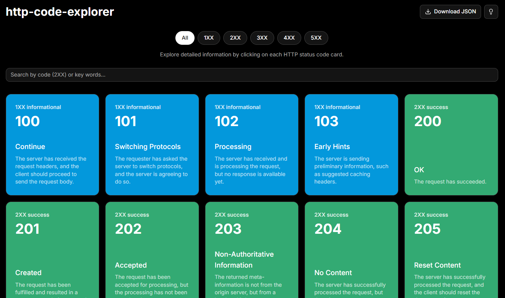

# HTTP Status Code Explorer



## 🚀 Overview

This **HTTP Status Code Explorer** serves as an interactive web application designed to help developers, students, and API enthusiasts easily explore, understand, and utilize HTTP status codes. From detailed descriptions to practical code snippets, this tool aims to demystify web communication and streamline your development workflow.

## Original Project Reference

This project is an evolution of my initial HTTP Status Code Explorer, which was built using pure HTML and JavaScript. You can find the original version here:

*   **[Original HTTP Status Code Explorer (HTML/JS)](https://github.com/Ulisses22/http-code-explorer)**

## ✨ Features

*   **Comprehensive Database:** Explore all standard HTTP status codes (1XX Informational, 2XX Success, 3XX Redirection, 4XX Client Error, 5XX Server Error).
*   **Intuitive Search:** Quickly find specific codes by number, message, description, or keywords.
*   **Category Filtering:** Filter codes by their respective categories (e.g., 2XX, 4XX) for focused exploration.
*   **Detailed Code View:** Click on any status code card to open a modal with:
    *   In-depth description.
    *   Practical code snippets (JavaScript Fetch API, Node.js Express, cURL) demonstrating usage and handling, with a clear, readable background.
    *   Links to official documentation (MDN Web Docs, RFCs) for further reading.
    *   Related status codes within the same category.
*   **Copy JSON Data:** Easily copy the full JSON data of any status code to your clipboard.
*   **JSON Download:** Download the entire dataset of HTTP status codes as a JSON file for offline use or integration into other projects.
*   **Developer Tips:** Get random, insightful tips to boost your coding journey.
*   **Responsive Design:** Optimized for a seamless experience across various devices, from desktop to mobile.
*   **Dark Theme Only:** A sleek, dark interface for comfortable viewing, ensuring a consistent visual experience.
*   **Improved SEO:** Enhanced metadata for better discoverability on search engines, especially for GitHub Pages deployment.

## 🛠️ Technologies Used

*   **Next.js 14+** (App Router)
*   **React**
*   **TypeScript**
*   **Tailwind CSS**
*   **shadcn/ui**
*   **Lucide React** (Icons)
*   **SweetAlert2** (for toasts/alerts)

## ⚙️ Getting Started

Follow these steps to set up and run the project locally on your machine.

### Prerequisites

Make sure you have Node.js (v18.x or higher) and npm (or yarn/pnpm) installed.

### Installation

1.  **Clone the repository:**
    ```bash
    git clone https://github.com/Ulisses22/http-code-explorer.git
    cd http-code-explorer
    ```

2.  **Install dependencies:**
    ```bash
    npm install
    # or
    yarn install
    # or
    pnpm install
    ```

### Running the Development Server

1.  **Start the development server:**
    ```bash
    npm run dev
    # or
    yarn dev
    # or
    pnpm dev
    ```

2.  **Open in your browser:**
    Open [http://localhost:3000](http://localhost:3000) with your browser to see the result.


## 📧 Contact

If you have any questions or feedback, feel free to reach out:

*   **Ulisses Alves:** [https://ulissesalves.nexgate.ch/](https://ulissesalves.nexgate.ch/)
*   **GitHub:** [https://github.com/Ulisses22/http-code-explorer](https://github.com/Ulisses22/http-code-explorer)

---
